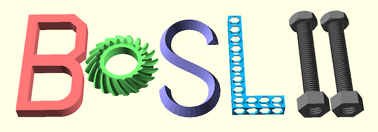

# BOSL2

**The Belfry OpenScad Library, v2**

A library for OpenSCAD, filled with useful tools, shapes, masks, math and manipulators, designed to make OpenSCAD easier to use.

- **NOTE:** BOSL2 IS PRE-ALPHA CODE.  THE CODE IS STILL BEING REORGANIZED.​
- **NOTE2:** CODE WRITTEN FOR BOSLv1 PROBABLY WON'T WORK WITH BOSL2!

 [**BOSL2 Docs**](https://github.com/revarbat/BOSL2/wiki)

## Installation

1. Download the .zip or .tar.gz release file for this library.
2. Unpack it. Make sure that you unpack the whole file structure. Some zipfile unpackers call this option "Use folder names". It should create either a `BOSL-v2.0` or `BOSL2-master` directory with the library files within it.  You should see "examples", "scripts", "tests", and other subdirectories.
3. Rename the unpacked main directory to `BOSL2`.
4. Move the `BOSL2` directory into the apropriate OpenSCAD library directory for your platform:
    - Windows: `My Documents\OpenSCAD\libraries\`
    - Linux: `$HOME/.local/share/OpenSCAD/libraries/`
    - Mac OS X: `$HOME/Documents/OpenSCAD/libraries/`
5. Restart OpenSCAD.

## Terminology

For purposes of the BOSL2 library, the following terms apply:
- **Left**: Towards X-
- **Right**: Towards X+
- **Front**/**Forward**: Towards Y-
- **Back**/**Behind**: Towards Y+
- **Bottom**/**Down**/**Below**: Towards Z-
- **Top**/**Up**/**Above**: Towards Z+

## Common Arguments:

Args     | What it is
-------- | ----------------------------------------
rounding | Radius of rounding for interior or exterior edges.
chamfer  | Size of chamfers/bevels for interior or exterior edges.
orient   | Axis a part should be oriented along.  Given as an XYZ triplet of rotation angles.  It is recommended that you use the `ORIENT_` constants from `constants.scad`.  Default is usually `ORIENT_Z` for vertical orientation.
anchor   | Side of the object that should be anchored to the origin. Given as a vector towards the side of the part to align with the origin.  It is recommended that you use the directional constants from `constants.scad`.  Default is usually `CENTER` for centered.

## Examples
A lot of the features of this library are to allow shorter, easier-to-read, intent-based coding.  For example:

[`BOSL2/transforms.scad`](https://github.com/revarbat/BOSL2/wiki/transforms.scad) Examples | Raw OpenSCAD Equivalent
------------------------------- | -------------------------------
`up(5)`                         | `translate([0,0,5])`
`xrot(30,cp=[0,10,20])`         | `translate([0,10,20]) rotate([30,0,0]) translate([0,-10,-20])`
`xspread(20,n=3)`               | `for (dx=[-20,0,20]) translate([dx,0,0])`
`zring(n=6,r=20)`               | `for (zr=[0:5]) rotate([0,0,zr*60]) translate([20,0,0])`
`skew_xy(xa=30,ya=45)`          | `multmatrix([[1,0,tan(30),0],[0,1,tan(45),0],[0,0,1,0],[0,0,0,1]])`

[`BOSL2/shapes.scad`](https://github.com/revarbat/BOSL2/wiki/shapes.scad) Examples | Raw OpenSCAD Equivalent
---------------------------------- | -------------------------------
`cube([10,20,30], anchor=BOTTOM);` | `translate([0,0,15]) cube([10,20,30], center=true);`
`cuboid([20,20,30], fillet=5, edges=EDGES_Z_ALL);` | `minkowski() {cube([10,10,20], center=true); sphere(r=5, $fn=32);}`
`prismoid([30,40],[20,30],h=10);`  | `hull() {translate([0,0,0.005]) cube([30,40,0.01], center=true); translate([0,0,9.995]) cube([20,30,0.01],center=true);}`
`xcyl(l=20,d=4);`                  | `rotate([0,90,0]) cylinder(h=20, d=4, center=true);`
`cyl(l=100, d=40, fillet=5);`      | `translate([0,0,50]) minkowski() {cylinder(h=90, d=30, center=true); sphere(r=5);}`

[`BOSL2/masks.scad`](https://github.com/revarbat/BOSL2/wiki/masks.scad) Examples | Raw Openscad Equivalent
----------------------------------- | -------------------------------
`chamfer_mask_z(l=20,chamfer=5);`   | `rotate(45) cube([5*sqrt(2), 5*sqrt(2), 20], center=true);`
`fillet_mask_z(l=20,fillet=5);`     | `difference() {cube([10,10,20], center=true); for(dx=[-5,5],dy=[-5,5]) translate([dx,dy,0]) cylinder(h=20.1, r=5, center=true);}`
`fillet_hole_mask(r=30,fillet=5);`  | `difference() {cube([70,70,10], center=true); translate([0,0,-5]) rotate_extrude(convexity=4) translate([30,0,0]) circle(r=5);}`

## The Library Files
The library files are as follows:

### Basics (Imported via std.scad)
  - [`transforms.scad`](transforms.scad): Commonly used transformations shortcuts.
  - [`distributors.scad`](distributors.scad): Modules and Functions to distribute items.
  - [`mutators.scad`](mutators.scad): Modules and Functions to mutate items.
  - [`attachments.scad`](attachments.scad): Modules and functions to enable attachments.
  - [`primitives.scad`](primitives.scad): Attachment aware replacements for built-in shapes.
  - [`shapes.scad`](shapes.scad): Common useful 3D shapes and structured objects.
  - [`shapes2d.scad`](shapes2d.scad): Common useful 2D shapes and drawing helpers.
  - [`masks.scad`](masks.scad): Shapes that are useful for masking with `difference()` and `intersect()`.

### Math (Imported via std.scad)
  - [`math.scad`](math.scad): Useful math helper functions.
  - [`vectors.scad`](vectors.scad): Functions for vector math.
  - [`arrays.scad`](arrays.scad): Functions to manipulate lists and arrays.
  - [`quaternions.scad`](quaternions.scad): Functions to work with quaternion rotations.
  - [`affine.scad`](affine.scad): Functions for affine transformation matrix math.
  - [`coords.scad`](coords.scad): Functions for coordinate system conversions and transformations.

### Geometry (Imported via std.scad)
  - [`geometry.scad`](geometry.scad): Functions to find line intersections, circles from 3 points, etc.
  - [`edges.scad`](edges.scad): Constants and functions to specify edges and corners.
  - [`vnf.scad`](vnf.scad): Vertices 'n' Faces structure to make creating `polyhedron()`s easier. 
  - [`paths.scad`](paths.scad): Functions and modules to work with arbitrary 3D paths.
  - [`regions.scad`](regions.scad): Perform offsets and boolean geometry on 2D paths and regions.

### Common (Imported via std.scad)
  - [`common.scad`](common.scad): Useful helpers for argument processing.
  - [`constants.scad`](constants.scad): Useful constants for vectors, edges, etc.
  - [`errors.scad`](errors.scad): Routines to help print out warnings and errors.
  - [`version.scad`](version.scad): Ways to parse and compare semantic versions.

### Processes
  - [`beziers.scad`](beziers.scad): Functions and modules to work with bezier curves.
  - [`threading.scad`](threading.scad): Modules to make triangular and trapezoidal threaded rods and nuts.
  - [`rounding.scad`](rounding.scad): Functions to help rounding corners in a path.
  - [`knurling.scad`](knurling.scad): Masks and shapes to help with knurling.
  - [`partitions.scad`](partitions.scad): Modules to help partition large objects into smaller assembled parts.
  - [`rounding.scad`](rounding.scad): Functions and modules to create rounded paths and boxes.
  - [`skin.scad`](skin.scad): Functions to skin surfaces between 2D cross-section paths.
  - [`hull.scad`](hull.scad): Functions to create 2D and 3D convex hulls.
  - [`triangulation.scad`](triangulation.scad): Functions to triangulate `polyhedron()` faces.
  - [`debug.scad`](debug.scad): Modules to help debug `polygons()`s and `polyhedron()`s

### Data Structures
  - [`strings.scad`](strings.scad): String manipulation functions.
  - [`stacks.scad`](stacks.scad): Functions to manipulate stack data structures.
  - [`queues.scad`](queues.scad): Functions to manipulate queue data structures.
  - [`structs.scad`](structs.scad): Structure/Dictionary creation and manipulation functions.

### Miscellaneous Parts
  - [`polyhedra.scad`](polyhedra.scad): Modules to create various regular and stellated polyhedra.
  - [`walls.scad`](walls.scad): Modules to create walls and structural elements for 3D printing.
  - [`cubetruss.scad`](cubetruss.scad): Modules to create modular open-framed trusses and joiners.
  - [`gears.scad`](gears.scad): Modules and functions to make gears, racks, worm, and worm gears.
  - [`joiners.scad`](joiners.scad): Modules to make joiner shapes for connecting separately printed objects.
  - [`sliders.scad`](sliders.scad): Modules for creating simple sliders and rails.
  - [`metric_screws.scad`](metric_screws.scad): Functions and modules to make metric screws, nuts, and screwholes.
  - [`linear_bearings.scad`](linear_bearings.scad): Modules to make mounts for LMxUU style linear bearings.
  - [`nema_steppers.scad`](nema_steppers.scad): Modules to make mounting holes for NEMA motors.
  - [`phillips_drive.scad`](phillips_drive.scad): Modules to create Phillips screwdriver tips.
  - [`torx_drive.scad`](torx_drive.scad): Functions and Modules to create Torx bit drive holes.
  - [`wiring.scad`](wiring.scad): Modules to render routed bundles of wires.
  - [`hingesnaps.scad`](hingesnaps.scad): Modules to make foldable, snap-locking parts.
  - [`bottlecaps.scad`](bottlecaps.scad): Modules to make standard beverage bottle caps and necks.
  - [`modular_hose.scad`](modular_hose.scad): Modules to make module hose segments and ends.

## Documentation
The full library docs can be found at https://github.com/revarbat/BOSL2/wiki

